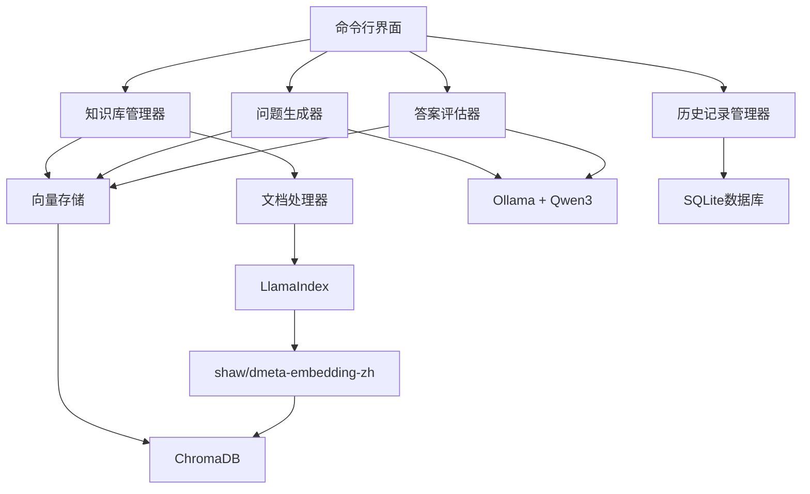

# Design Document

## Overview

知识库问答系统是一个基于向量检索和大语言模型的智能学习工具。系统采用模块化架构，通过 LlamaIndex 处理文档，使用 ChromaDB 存储向量，集成 Ollama 运行 Qwen3:1.7b 模型进行问答生成和评估。系统提供命令行界面，支持多知识库管理、智能出题、答案评估和历史回顾功能。

## Architecture

### 系统架构图



### 技术栈集成

- **文档处理层**: LlamaIndex 负责解析 PDF、TXT、MD、EPUB 文件
- **向量存储层**: ChromaDB 存储文档向量和元数据
- **模型服务层**: Ollama 提供 Qwen3:1.7b 模型服务
- **嵌入模型**: shaw/dmeta-embedding-zh-small-q4 处理中文向量化
- **持久化层**: SQLite 存储问答历史和知识库元数据
- **接口层**: Click 框架构建命令行界面

## Components and Interfaces

### 1. 命令行界面 (CLI)

**职责**: 提供用户交互接口，解析命令参数，调用相应服务

**主要命令**:
```bash
# 创建知识库
knowledge new --name <name> --file <file_path> [--file <file_path>...]

# 开始新问答
knowledge <name> review new

# 查看历史记录
knowledge <name> review history [--limit <n>] [--page <n>]

# 列出所有知识库
knowledge list

# 删除知识库
knowledge delete <name>

# 显示帮助
knowledge --help
```

**接口设计**:
```python
class KnowledgeCLI:
    def __init__(self):
        self.kb_manager = KnowledgeBaseManager()
        self.question_generator = QuestionGenerator()
        self.answer_evaluator = AnswerEvaluator()
        self.history_manager = HistoryManager()
    
    def create_knowledge_base(self, name: str, files: List[str]) -> None
    def start_new_review(self, kb_name: str) -> None
    def show_history(self, kb_name: str, limit: int, page: int) -> None
    def list_knowledge_bases(self) -> None
    def delete_knowledge_base(self, name: str) -> None
```

### 2. 知识库管理器 (KnowledgeBaseManager)

**职责**: 管理知识库的创建、删除、文档导入和向量化

**核心功能**:
- 文档解析和预处理
- 向量化和存储
- 知识库元数据管理

**接口设计**:
```python
class KnowledgeBaseManager:
    def __init__(self):
        self.document_processor = DocumentProcessor()
        self.vector_store = VectorStore()
        self.metadata_db = MetadataDatabase()
    
    def create_knowledge_base(self, name: str, files: List[str]) -> KnowledgeBase
    def delete_knowledge_base(self, name: str) -> bool
    def get_knowledge_base(self, name: str) -> Optional[KnowledgeBase]
    def list_knowledge_bases(self) -> List[str]
    def add_documents(self, kb_name: str, files: List[str]) -> None
```

### 3. 文档处理器 (DocumentProcessor)

**职责**: 使用 LlamaIndex 解析不同格式的文档

**支持格式**: PDF, TXT, MD, EPUB

**接口设计**:
```python
class DocumentProcessor:
    def __init__(self):
        self.loaders = {
            '.pdf': PDFReader(),
            '.txt': SimpleDirectoryReader(),
            '.md': SimpleDirectoryReader(),
            '.epub': EpubReader()
        }
    
    def process_file(self, file_path: str) -> List[Document]
    def chunk_documents(self, documents: List[Document]) -> List[Document]
    def validate_file_format(self, file_path: str) -> bool
```

### 4. 向量存储 (VectorStore)

**职责**: 管理 ChromaDB 向量数据库，处理文档向量化和检索

**接口设计**:
```python
class VectorStore:
    def __init__(self):
        self.client = chromadb.Client()
        self.embedding_model = "shaw/dmeta-embedding-zh-small-q4"
    
    def create_collection(self, kb_name: str) -> None
    def add_documents(self, kb_name: str, documents: List[Document]) -> None
    def similarity_search(self, kb_name: str, query: str, k: int = 5) -> List[Document]
    def delete_collection(self, kb_name: str) -> None
```

### 5. 问题生成器 (QuestionGenerator)

**职责**: 基于知识库内容生成学习问题

**策略**:
- 从知识库中随机选择文档片段
- 使用 Qwen3 模型生成相关问题
- 确保问题质量和多样性

**接口设计**:
```python
class QuestionGenerator:
    def __init__(self):
        self.llm_client = OllamaClient("qwen3:1.7b")
        self.vector_store = VectorStore()
    
    def generate_question(self, kb_name: str) -> Question
    def _select_content_for_question(self, kb_name: str) -> str
    def _create_question_prompt(self, content: str) -> str
    def _validate_question_quality(self, question: str) -> bool
```

### 6. 答案评估器 (AnswerEvaluator)

**职责**: 评估用户答案的正确性并提供反馈

**评估维度**:
- 事实准确性
- 完整性
- 相关性

**接口设计**:
```python
class AnswerEvaluator:
    def __init__(self):
        self.llm_client = OllamaClient("qwen3:1.7b")
        self.vector_store = VectorStore()
    
    def evaluate_answer(self, question: str, user_answer: str, kb_name: str) -> EvaluationResult
    def _retrieve_relevant_context(self, question: str, kb_name: str) -> str
    def _create_evaluation_prompt(self, question: str, answer: str, context: str) -> str
    def _parse_evaluation_result(self, llm_response: str) -> EvaluationResult
```

### 7. 历史记录管理器 (HistoryManager)

**职责**: 管理问答历史记录的存储和检索

**存储内容**:
- 问题和答案
- 评估结果
- 时间戳
- 知识库关联

**接口设计**:
```python
class HistoryManager:
    def __init__(self):
        self.db = SQLiteDatabase("qa_history.db")
    
    def save_qa_record(self, record: QARecord) -> None
    def get_history(self, kb_name: str, limit: int, offset: int) -> List[QARecord]
    def get_record_by_id(self, record_id: int) -> Optional[QARecord]
    def delete_history(self, kb_name: str) -> None
```

## Data Models

### 核心数据模型

```python
@dataclass
class KnowledgeBase:
    name: str
    created_at: datetime
    file_count: int
    document_count: int
    description: Optional[str] = None

@dataclass
class Question:
    id: str
    content: str
    kb_name: str
    source_context: str
    difficulty: str
    created_at: datetime

@dataclass
class EvaluationResult:
    is_correct: bool
    score: float  # 0-10
    feedback: str
    missing_points: List[str]
    reference_answer: str
    strengths: List[str]

@dataclass
class QARecord:
    id: int
    kb_name: str
    question: str
    user_answer: str
    evaluation: EvaluationResult
    created_at: datetime
```

### 数据库模式

```sql
-- 知识库元数据
CREATE TABLE knowledge_bases (
    name TEXT PRIMARY KEY,
    created_at TIMESTAMP,
    file_count INTEGER,
    document_count INTEGER,
    description TEXT
);

-- 问答历史记录
CREATE TABLE qa_records (
    id INTEGER PRIMARY KEY AUTOINCREMENT,
    kb_name TEXT,
    question TEXT,
    user_answer TEXT,
    is_correct BOOLEAN,
    score REAL,
    feedback TEXT,
    reference_answer TEXT,
    created_at TIMESTAMP,
    FOREIGN KEY (kb_name) REFERENCES knowledge_bases(name)
);
```

## Error Handling

### 错误分类和处理策略

1. **文件处理错误**
   - 文件不存在: 显示清晰错误信息，建议检查路径
   - 格式不支持: 列出支持的格式
   - 文件损坏: 提示文件可能损坏，建议重新获取

2. **模型服务错误**
   - Ollama 服务不可用: 检查服务状态，提供启动指导
   - 模型加载失败: 验证模型是否正确安装
   - API 调用超时: 实现重试机制

3. **数据库错误**
   - ChromaDB 连接失败: 检查服务状态
   - SQLite 操作失败: 检查文件权限和磁盘空间
   - 数据完整性错误: 提供数据修复建议

4. **用户输入错误**
   - 无效命令: 显示帮助信息
   - 参数缺失: 提示必需参数
   - 知识库不存在: 列出可用知识库

### 错误处理实现

```python
class KnowledgeSystemError(Exception):
    """系统基础异常类"""
    pass

class FileProcessingError(KnowledgeSystemError):
    """文件处理异常"""
    pass

class ModelServiceError(KnowledgeSystemError):
    """模型服务异常"""
    pass

class DatabaseError(KnowledgeSystemError):
    """数据库异常"""
    pass

def handle_error(func):
    """错误处理装饰器"""
    def wrapper(*args, **kwargs):
        try:
            return func(*args, **kwargs)
        except FileProcessingError as e:
            click.echo(f"文件处理错误: {e}", err=True)
        except ModelServiceError as e:
            click.echo(f"模型服务错误: {e}", err=True)
        except DatabaseError as e:
            click.echo(f"数据库错误: {e}", err=True)
        except Exception as e:
            click.echo(f"未知错误: {e}", err=True)
    return wrapper
```

## Testing Strategy

### 测试层次和覆盖范围

1. **单元测试**
   - 各组件独立功能测试
   - 数据模型验证测试
   - 工具函数测试
   - 目标覆盖率: 90%+

2. **集成测试**
   - 组件间交互测试
   - 数据库操作测试
   - 外部服务集成测试
   - 端到端命令执行测试

3. **性能测试**
   - 大文档处理性能
   - 向量检索响应时间
   - 并发操作处理能力
   - 内存使用优化验证

4. **用户体验测试**
   - 命令行界面易用性
   - 错误信息清晰度
   - 帮助文档完整性
   - 中文处理准确性

### 测试工具和框架

```python
# 测试依赖
pytest==7.4.0
pytest-asyncio==0.21.0
pytest-mock==3.11.1
pytest-cov==4.1.0

# 测试示例
class TestKnowledgeBaseManager:
    def test_create_knowledge_base_success(self):
        # 测试成功创建知识库
        pass
    
    def test_create_knowledge_base_duplicate_name(self):
        # 测试重复名称处理
        pass
    
    def test_process_unsupported_file_format(self):
        # 测试不支持格式处理
        pass

class TestQuestionGenerator:
    def test_generate_question_from_content(self):
        # 测试问题生成
        pass
    
    def test_question_quality_validation(self):
        # 测试问题质量验证
        pass

# 性能测试
class TestPerformance:
    def test_large_document_processing_time(self):
        # 测试大文档处理时间
        pass
    
    def test_vector_search_response_time(self):
        # 测试向量检索响应时间
        pass
```

### 测试数据和环境

- **测试数据**: 准备不同格式和大小的示例文档
- **模拟环境**: 使用 Docker 容器模拟 Ollama 和 ChromaDB 服务
- **CI/CD**: 集成 GitHub Actions 进行自动化测试
- **测试隔离**: 每个测试使用独立的临时数据库和向量存储